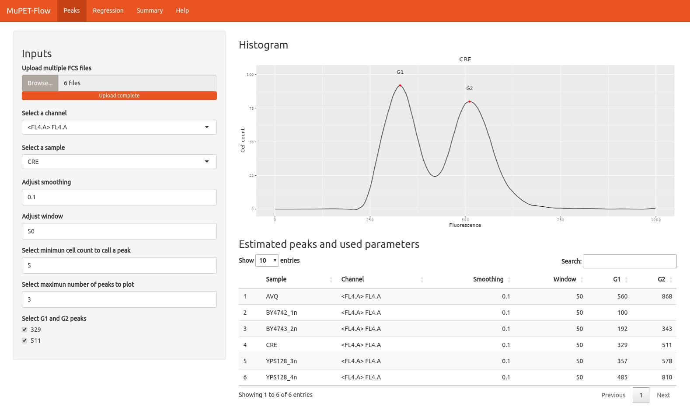

# MuPET-Flow: Multiple Ploidy Estimation Tool from Flow cytometry data

Created: January 30, 2023

Updated: December 16, 2024

Authors: Gómez-Muñoz, C.*

*cintia.gomez_munoz@sorbonne-universite.fr

---

## Introduction

MuPET-Flow is a Shiny app intended to analyze flow cytometry data to produce fluorescence histograms, estimate peaks' intensity and calculate ploidy using known standards.




We will update the app description shortly. Feel free to report any bugs you encounter.

## Installation and pre-requisites

MuPET-Flow can be installed by downloading the files on this repository manually or via **GitHub CLI**:

```bash
gh repo clone CintiaG/MuPET-Flow
```

These are the libraries required to run MuPET-Flow. Here we provide links to their source or installation instructions.

* [RStudio](https://posit.co/download/rstudio-desktop/)
* [shiny](https://shiny.posit.co/r/getstarted/shiny-basics/lesson1/index.html)
* [shinythemes](https://rstudio.github.io/shinythemes/)
* [flowCore](https://bioconductor.org/packages/release/bioc/html/flowCore.html)
* [zoo](https://cran.r-project.org/web/packages/zoo/index.html)
* [ggplot2](https://ggplot2.tidyverse.org/)
* [DT](https://rstudio.github.io/DT/)
* [tidyverse](https://www.tidyverse.org/packages/)
* [ggrepel](https://cran.r-project.org/web/packages/ggrepel/readme/README.html)
* [gridExtra](https://cran.r-project.org/web/packages/gridExtra/index.html)
* [markdown](https://cran.r-project.org/web/packages/markdown/index.html)

### How to run MuPET-Flow

Once **MuPET-Flow** is downloaded from GitHub and all the required libraries are installed, the file `app.R` needs to be opened in **RStudio**.

1. Run by clicking the “Run App” button in RStudio (highlighted with a red rectangle in the image below).
2. Click on the "Browse" button to upload the FCS files.
3. Navigate to the appropriate directory. Example data should be within the same directory of **MuPET-Flow** (`path_to_MuPET-Flow/example_data/Sc_dataset_rep1`).


### Recent updates.

**December 16, 2024:** The app was prepared to be published in The Comprehensive R Archive Network (CRAN), which now installs all the dependencies automatically and provides in-app example data.

**June 14th, 2024:** A bug affecting histogram calculations for gated files was detected and fixed. Consequently, the peaks calculated with this new version may slightly differ from those generated by the previous version.

**April 12th, 2024:** Significant change in histogram calculation: All files are now converted to histograms ranging from 0 to 1000, as opposed to using the bin scale of the instrument. This modification enables quicker processing of files from newer instruments capable of storing data in larger bin sizes.

<!--
Pending
A minimum of two different standards is required, but more are recommended.
Select minimum cell counts to call peak, this removes noise
 -->
